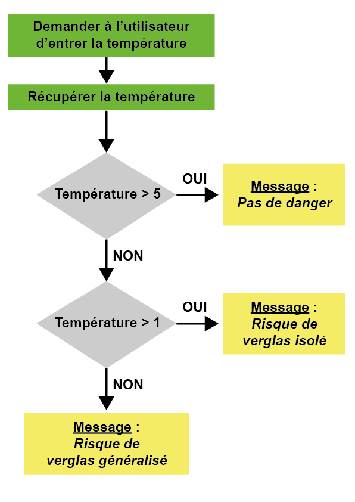

# Algorithme et pseudo-code.  
## Allons plus loin !

Demandons à l’utilisateur d’entrer une valeur (entière) en degrés Celsius (°c) :

* Si la température est supérieure à 5°c, lui dire qu’il n’y a pas de danger !
* Si la température est comprise entre 1 et 5°c inclus, lui dire qu’il existe un danger de plaques de verglas isolées !
* Si la température est en dessous de 1°c inclus, lui dire qu’il existe un danger de verglas généralisé !

On demande d’écrire un algorithme en utilisant un organigramme

## Création de notre organigramme

